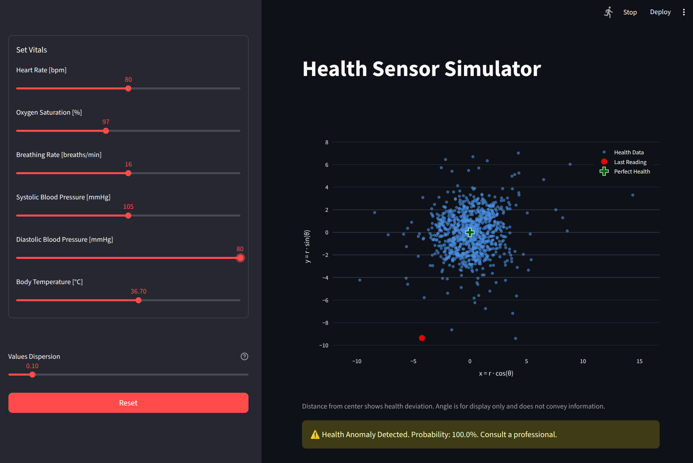

# Health Sensor Simulator

**[COMPLETE]** **Current Status**: Fully functional health data simulator with interactive Streamlit UI and FastAPI backend. Real-time health data visualization with automatic refresh and configurable parameters.

## Project Description
**Health Sensor Simulator** is a comprehensive health monitoring simulation platform built with **FastAPI** and **Streamlit**. It simulates realistic wearable health device data including heart rate, breathing rate, blood oxygen saturation, blood pressure, and body temperature. The system features an interactive web interface for real-time data visualization and parameter configuration.



## Key Features
- **FastAPI-based REST API** with OpenAPI documentation.
- **Anomaly detection** using a trained Extended Isolation Forest model (`eif.joblib`).
- **Data simulation** to generate realistic vital sign measurements.
- **Outbound alarm client** for notifying external services when anomalies are found.
- **Streamlit web interface** for configuring health variable parameters.
- **Comprehensive unit tests** for API endpoints and anomaly detection model.
- **Dockerized** for consistent deployment.


The Health Sensor Simulator is part of a stack of applications that allow a user to track the metrics and get notified of alarms in real time, and analyze historical values, using intuitive dashboards. The stack's project is located in this [link](https://github.com/marcoom/health-anomaly-detector-stack).


## Current Functionality
### Working Features
- **FastAPI REST API** with OpenAPI documentation
- **Streamlit Web Interface** with interactive health parameter controls
- **Real-time Data Generation** with configurable variance and automatic refresh
- **Health Data Visualization** using radial distance plots
- **Parameter Validation** with realistic health value ranges
- **Integrated Launcher** running both services from single command

### API Endpoints
- `GET /api/v1/version` - Returns the service version

---

## Requirements
- **Python**: 3.11  
- **pip** and **virtualenv** (recommended)  
- For Docker usage: Docker Engine 20.10+  

---

## Installation & Running

### 1. Clone the repository
```bash
git clone https://github.com/marcoom/health-sensor-simulator.git
cd health-sensor-simulator
```

### 2. Environment Setup
```bash
# Create virtual environment (Python 3.11 required)
python3.11 -m venv .venv
source .venv/bin/activate   # On Windows: .venv\Scripts\activate

# Install dependencies using Makefile
make install-dev            # Installs all dependencies including dev tools
# OR install only production dependencies
make install               # Production dependencies only
```

### 3. Run the Service
```bash
# Method 1: Using uvicorn directly
uvicorn src.main:app --host 0.0.0.0 --port 8000 --reload

# Method 2: Using the Makefile (recommended)
make run
```

### 4. Access the Service
- **API Base URL**: [http://localhost:8000](http://localhost:8000)
- **Interactive API Documentation (Swagger UI)**: [http://localhost:8000/docs](http://localhost:8000/docs)
- **Alternative API Documentation (ReDoc)**: [http://localhost:8000/redoc](http://localhost:8000/redoc)

### 5. Test the API
```bash
# Test the version endpoint
curl http://localhost:8000/api/v1/version

# Expected response:
# {"version":"0.1.0"}
```  

---

### Running with Docker
Build and run the container:
```bash
# Using Makefile commands (recommended)
make docker-build
make docker-run

# OR using Docker directly
docker build -t health-sensor-simulator .
docker run -p 8000:8000 health-sensor-simulator
```

---

## Development & Testing

### Documentation
The full user and API guide is deployed to GitHub Pages, and can be found at this [link](https://marcoom.github.io/health-sensor-simulator/).

### Running Tests
```bash
# Run all tests
make test

# Run tests with coverage report
make test-coverage

# Run tests manually with pytest
pytest tests/ -v
```

### Development Setup
```bash
# Install development dependencies
make install-dev

# This includes:
# - pytest for testing
# - coverage for test coverage
# - httpx for async HTTP testing
# - All documentation tools
```

### Building Documentation
```bash
# Build HTML documentation
make docs-html

# Build PDF documentation (requires LaTeX)
make docs-pdf

# Clean documentation build files
make docs-clean
```

---

## Project Structure
```text
.
├── data/                         # Datasets and trained models
│   ├── models/                   # ML model artifacts (e.g., Isolation Forest)
│   └── processed/                 # Processed datasets
├── docs/                         # Project documentation (Sphinx, diagrams, business notes)
├── src/                          # Main FastAPI application package
│   ├── app/
│   │   ├── api/                  # API routes (GET /version, GET /vitals)
│   │   ├── schemas/              # Pydantic models for request/response data
│   │   ├── services/             # Business logic (data simulation, anomaly detection, alarm client)
│   │   ├── ui/                   # Streamlit UI components (app, config, helpers, visualization)
│   │   ├── utils/                # Utilities (logging, helpers)
│   │   └── version.py            # Service version info
│   └── main.py                   # FastAPI entry point (app setup and startup tasks)
├── notebooks/                    # Jupyter notebooks (dataset generation, model training)
├── requirements/                 # Base and development dependencies
├── tests/                        # Unit tests for API and anomaly detection model
├── Dockerfile                    # Docker image definition for the API
└── README.md                     # Project overview and usage instructions
```

---

## License
This project is licensed under the **MIT License** — you are free to use, modify, and distribute it, with attribution. See the [LICENSE](LICENSE) file for details.
